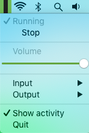

Menu Playthrough
================
Play an audio input into an output, in your menubar!



Dependencies
------------
- [RUMPS](https://github.com/jaredks/rumps/)
- [pysounddevice-hotplug](https://github.com/melvyn2/python-sounddevice-hotplug)
- [PyInstaller](https://github.com/pyinstaller/pyinstaller)

Running/Building
----------------
You can run the progam directly:

```bash
$ ./main.py  # or
$ python3 main.py
```
Or you can build it with PyInstaller and run the result:

```bash
$ pyinstaller main.spec
$ open dist/MenuPlaythrough.app  # or
$ dist/MenuPlaythrough/MenuPlaythrough
```

License
-------
This program is licensed under the GNU General Public License version 3.
The full license is included in the [LICENSE file](LICENSE), or can be obtained [online here.](https://www.gnu.org/licenses/gpl.txt)